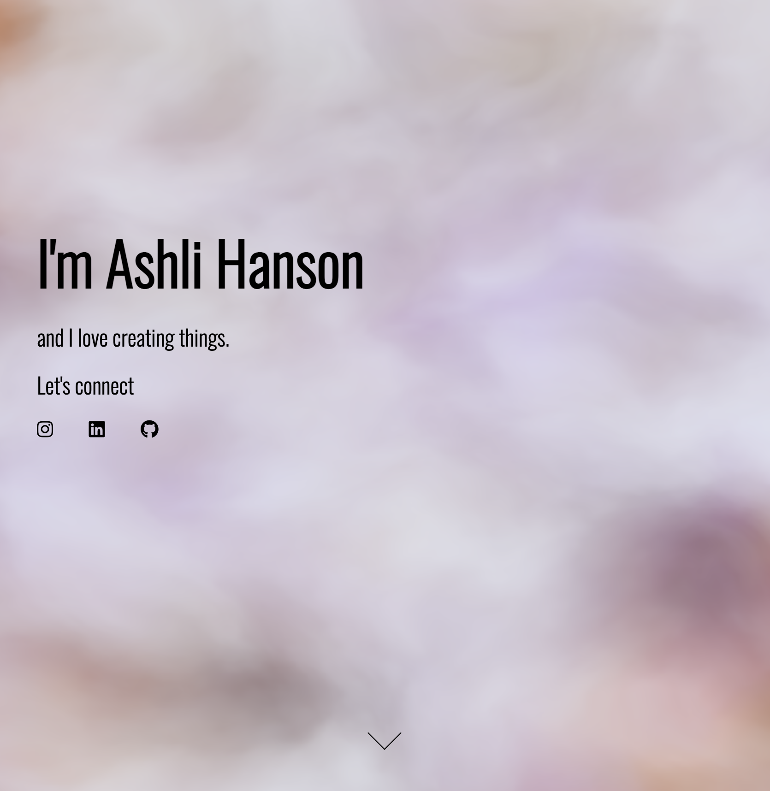

# Portfolio
An original website carefully curated for myself to showcase my portfolio and talent as a web developer.

# [Check it out!](https://ashlinhanson.github.io/portfolio/)


## Use Instructions 
Click on the deployed link above and scroll the one page website and view my skills, project portfolio, and contact information.

## Installation
To run this locally, you will need to clone the repository to your local machine.

HTTPS:
````
$ git clone https://github.com/ashlinhanson/portfolio.git
````
SSH:
````
$ git clone git@github.com:ashlinhanson/portfolio.git
````
Once it has been cloned, open the index.html document in your preferred browser.

## Technologies Used
Bootstrap, Vanta.js, CSS, and HTML5.
 
