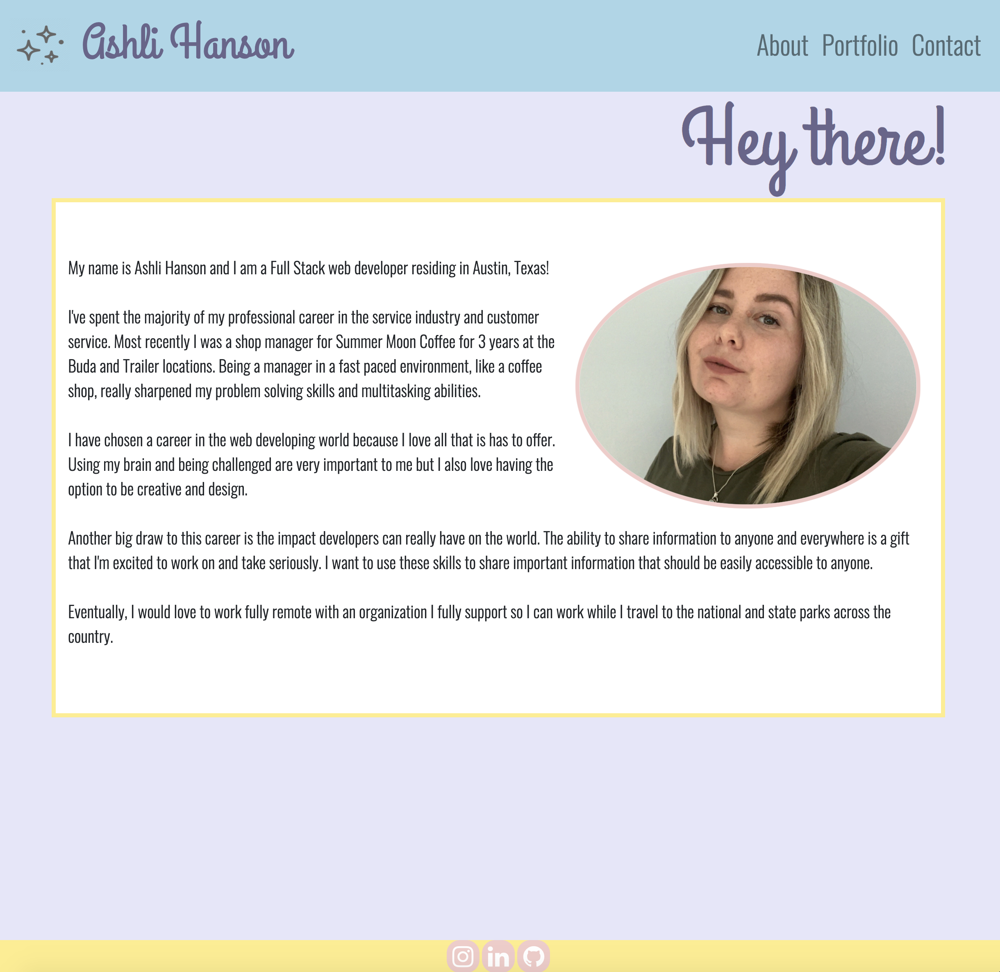

# Portfolio

## Deployed Page : https://ashlinhanson.github.io/portfolio/

Portfolio website created by Ashli Hanson, for Ashli Hanson. See the link above for the deployed version. 

This webpage consists of three pages total.
First being a quick bio about myself.

Second is my portfolio with examples of my work.

Third is some basic contact information to get in touch with me.

I chose a simple and minimal design for a clean user experience with small personal touches with placeholder images and colors. I find minimal websites with well coordinated colors pleasing and easy to use.  

This webpage was designed with 
## Bootstrap, CSS, and HTML5.

